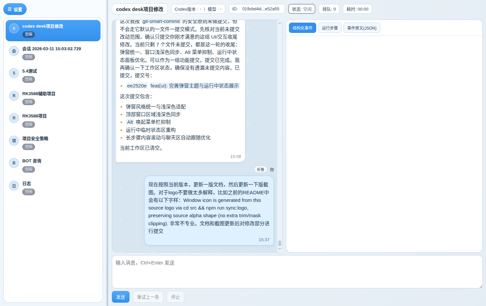
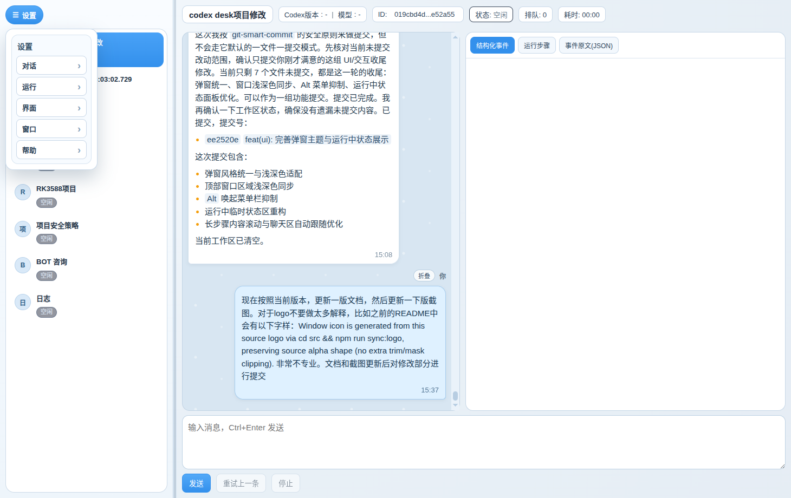
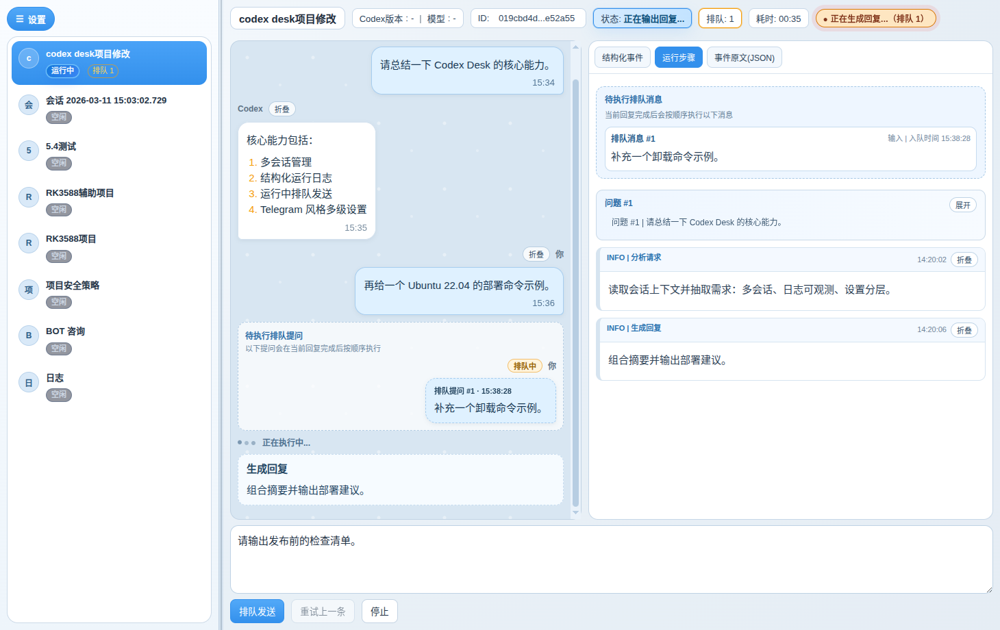

# codex-desk-electron

Electron desktop client for Codex CLI, focused on multi-conversation workflow and runtime observability.

## Logo


Window icon is generated from this source logo via `cd src && npm run sync:logo`.

## Quick Workflow

1. Create/switch conversation from the left sidebar.
2. Input prompt and send (`Ctrl+Enter`).
3. Watch runtime logs in `Structured / Workflow / Raw JSON` tabs.
4. Queue follow-up questions while current response is running.
5. Use quick settings for theme/language/layout adjustments.

## UI Preview

Main workspace:



Quick settings (Telegram-style nested menu):



Workflow/runtime view:



## Language

- 中文文档: [README.zh-CN.md](./README.zh-CN.md)
- English docs: [README.en.md](./README.en.md)

## Documentation

- Quick Start: [docs/quick-start.md](./docs/quick-start.md)
- User Guide: [docs/user-guide.md](./docs/user-guide.md)
- CLI vs GUI: [docs/cli-vs-gui.md](./docs/cli-vs-gui.md)
- Architecture: [docs/architecture.md](./docs/architecture.md)
- Dev Guide: [docs/dev-guide.md](./docs/dev-guide.md)
- Ubuntu DEB Deploy: [docs/deploy-ubuntu.md](./docs/deploy-ubuntu.md)
- Uninstall Guide: [docs/uninstall.md](./docs/uninstall.md)
- FAQ: [docs/faq.md](./docs/faq.md)
- Changelog: [CHANGELOG.md](./CHANGELOG.md)
- LLM Readable Map: [llm-readable/README.md](./llm-readable/README.md)

## Current Validation Scope

- Verified: `Ubuntu 22.04`
- Not yet verified: `Windows`, `macOS`

## Quick Run

```bash
cd /home/shecannotsee/Desktop/projects/codex-desk-electron
./start.sh
```

`start.sh` auto-installs missing dependencies, syncs logo resources, then launches app.

## Ubuntu DEB Build

```bash
cd /home/shecannotsee/Desktop/projects/codex-desk-electron/src
npm run dist:deb
```

## Docs Screenshot Capture

```bash
cd /home/shecannotsee/Desktop/projects/codex-desk-electron/src
npm run capture:docs
```

## License

MIT, see [LICENSE](./LICENSE).
