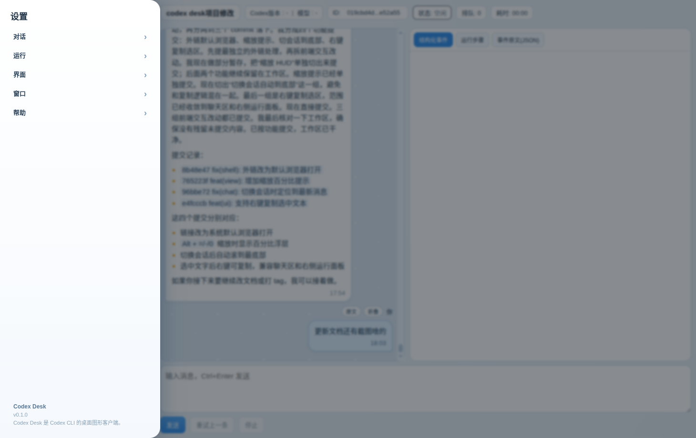

# conductor

Electron desktop client for Codex CLI and Claude Code. It keeps Electron focused on windowing, rendering, IPC, menus, and desktop integration, while the main-process business code is organized by domain: CLI bridges, Telegram integration, credential security, app controller, and renderer modules.

## Logo


## Current Capabilities

- Multi-conversation workspace with per-conversation working directories.
- Codex execution through `codex exec`, with native session resume/fork support and app-server mode when available.
- Claude Code execution through `claude -p --output-format stream-json`, with native session resume/fork support.
- Runtime observability: workflow steps, structured events, raw JSON, phase, elapsed time, and queued messages.
- Running-message queue: follow-up messages are queued per conversation and executed serially.
- Image attachments for `codex exec --image` compatible flows.
- Import/export Conductor session files (`.jsonl`) with Codex/Claude provider metadata.
- Telegram notifications and Telegram remote-control commands.
- Credential vault with master-password lock/unlock for Telegram tokens.
- Quick settings: language, theme, layout, zoom, runtime/sidebar visibility, notification/remote-control settings.
- Bottom conversation directory: left-click opens it in the system file manager; right-click copies the path.
- Local file links in Markdown open through the system, external HTTP links open in the default browser.

## Screenshots





## Documentation

- 中文入口: [README.zh-CN.md](./README.zh-CN.md)
- English entry: [README.en.md](./README.en.md)
- Quick Start: [docs/quick-start.md](./docs/quick-start.md)
- User Guide: [docs/user-guide.md](./docs/user-guide.md)
- CLI vs GUI: [docs/cli-vs-gui.md](./docs/cli-vs-gui.md)
- Architecture: [docs/architecture.md](./docs/architecture.md)
- Dev Guide: [docs/dev-guide.md](./docs/dev-guide.md)
- Ubuntu DEB Deploy: [docs/deploy-ubuntu.md](./docs/deploy-ubuntu.md)
- Uninstall Guide: [docs/uninstall.md](./docs/uninstall.md)
- FAQ: [docs/faq.md](./docs/faq.md)
- Changelog: [CHANGELOG.md](./CHANGELOG.md)

## Project Layout

```text
src/main/              Electron main process and domain modules
src/main/codex/        Codex CLI/app-server bridge, output parsing, usage metadata
src/main/claude/       Claude Code print-mode bridge, stream-json parsing, usage metadata
src/main/telegram/     Telegram API, sender, updates, notification UI state
src/main/security/     Credential vault and encryption helpers
src/main/app_controller/ AppController mixins and runtime orchestration
src/renderer/          HTML/CSS and TypeScript renderer modules
docs/                  User, architecture, deployment and development docs
notes/                 Project-local notes only
```

`src/app/`, `conductor-workspace/`, `.conductor/`, and `src/node_modules/` are generated/runtime directories and are intentionally ignored.

## Quick Run

Ubuntu/Linux:

```bash
cd /home/shecannotsee/Desktop/projects/conductor
./start.sh
```

Windows PowerShell:

```powershell
cd E:\workspace\conductor
.\start.ps1
```

Detached Windows launch:

```powershell
.\start-detached.ps1
```

Manual development run:

```bash
cd src
npm install
npm run check
npm start
```

## Validation

Primary validation command:

```bash
cd src
npm run check
```

Full build:

```bash
cd src
npm run build
```

## Docs Screenshot Capture

Use the dedicated docs-capture mode. It opens a separate Electron window and exits automatically after writing screenshots.

```bash
cd src
npm run capture:docs
```

## Platform Status

- Verified: Ubuntu 22.04
- Verified: Windows development run
- Not yet verified: macOS

## License

MIT, see [LICENSE](./LICENSE).
