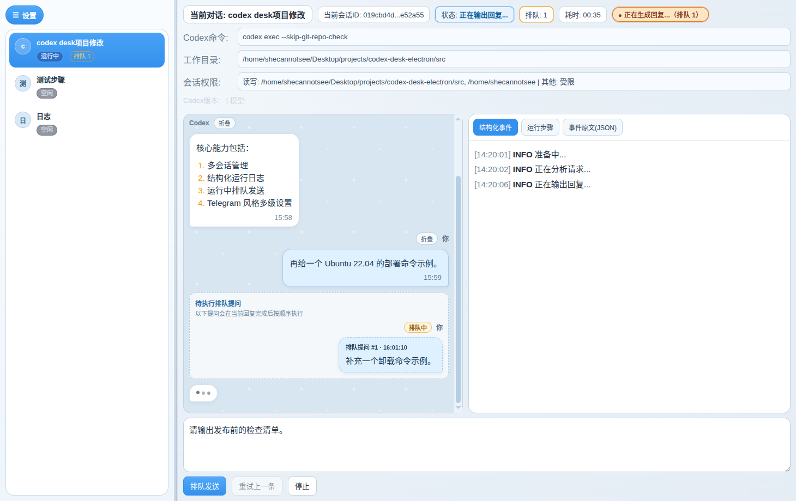
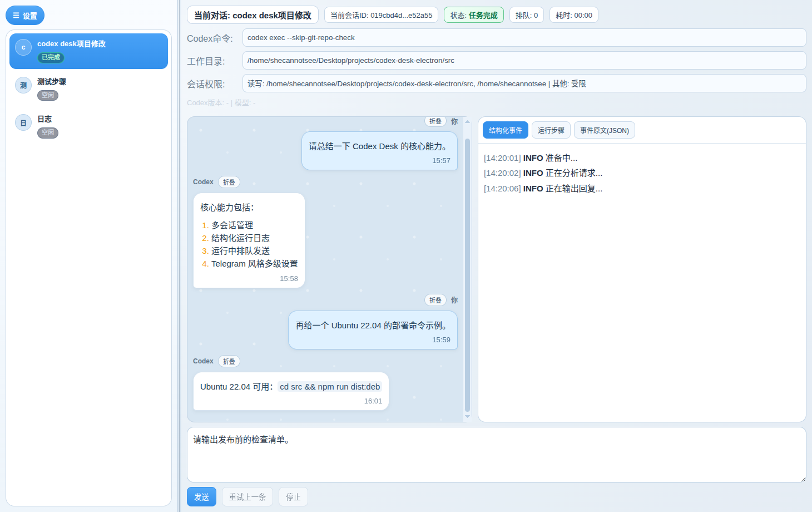

# CLI 与 GUI 对照（核心）

## 1. 为什么需要 GUI

Codex CLI 足够强，但在长期多轮、多会话使用中常见痛点：

1. 会话和历史管理分散。
2. 运行过程可观测性弱。
3. 高频操作（重试、排队、日志查看、布局切换）重复且易错。

GUI 目标不是替代 CLI，而是提供可视化编排层。

## 2. CLI 与 GUI 功能对照表

| 功能 | CLI 原生 | GUI 状态 | 说明 |
|---|---|---|---|
| 发送提示词执行 | 支持 | 支持 | 底层仍调用 `codex exec` |
| 会话续聊（resume） | 支持 | 支持 | GUI 自动维护 sessionId |
| 多会话列表管理 | 弱支持 | 增强 | 新建/重命名/切换/关闭 |
| 运行中继续发送（排队） | 不支持 | 增强 | 按会话串行队列 |
| 失败后一键重试 | 不支持 | 增强 | 自动回放上一条 user 消息 |
| 结构化事件面板 | 不支持 | 仅 GUI | 可读事件流 |
| 运行步骤面板 | 不支持 | 仅 GUI | 默认折叠，可逐条展开 |
| 排队消息可视化 | 不支持 | 仅 GUI | 运行步骤页展示内容/顺序/时间 |
| 原始 JSON 面板 | 部分支持 | 增强 | GUI 做归档浏览 |
| 版本/模型探测 | 手动 | 增强 | 一键刷新 + 元信息展示 |
| 右键会话菜单 | 不支持 | 仅 GUI | 左侧右键完成核心会话动作 |
| Telegram 风格分层设置 | 不支持 | 仅 GUI | 一级分组 + 二级详情 |
| 深色/浅色主题 | 不支持 | 仅 GUI | 持久化，含运行步骤与滚动条配色 |
| 关闭窗口保护 | 不支持 | 仅 GUI | 运行中弹确认 |
| 字号/面板显隐/侧栏拖拽 | 不支持 | 仅 GUI | 阅读密度可调 |

## 3. 等价命令与差异

### 基本等价

GUI 发送消息约等价于：

```bash
codex exec <PROMPT>
```

### 关键差异

1. GUI 自动附加和清洗参数（如 `--json`、resume 行为）。
2. GUI 可从命令、配置和运行输出多路推断模型。
3. GUI 持久化会话、运行态和 UI 偏好。

## 4. 典型工作流（输入到结果）

1. 用户在输入框发送消息。
2. Renderer 经 IPC 调主进程 `chat:send`。
3. 主进程启动 `CodexRunner`。
4. 运行事件实时回传到三类面板。
5. 完成后写回 assistant 消息并更新会话状态。

### 截图

- 自动截图命令：`cd src && npm run capture:docs`
- 输入并发送  

- 运行中日志  

- 完成结果  


## 5. 兼容性说明

- 已验证：`Ubuntu 22.04`
- 未验证：`Windows`、`macOS`

## 6. 大模型友好阅读入口

- 根目录 `llm-readable/` 提供大模型快速预览入口：
  - `system-map.md`
  - `core-flows.md`
  - `change-hotspots.md`
  - `task-prompts.md`
