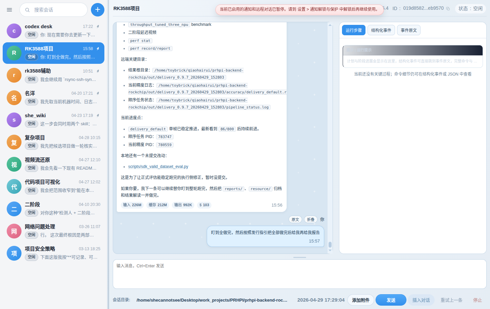
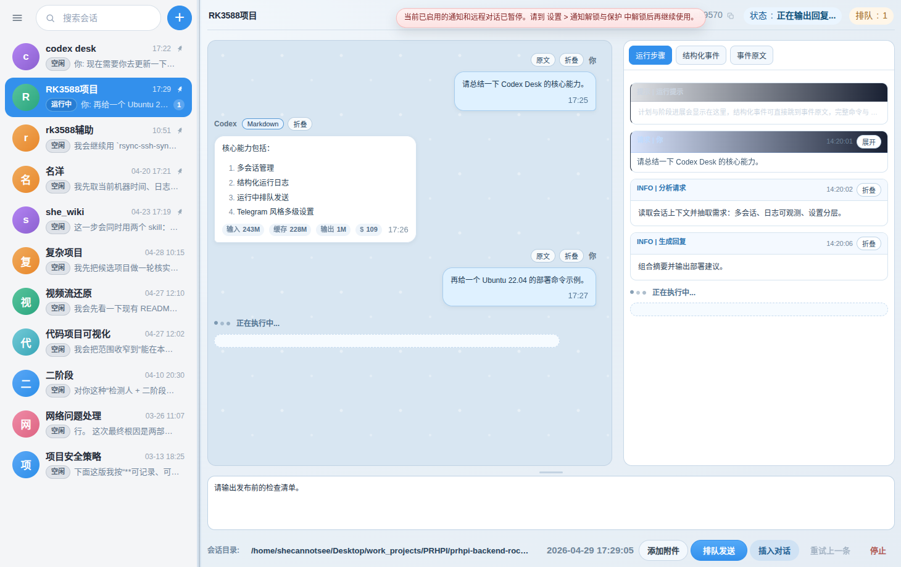
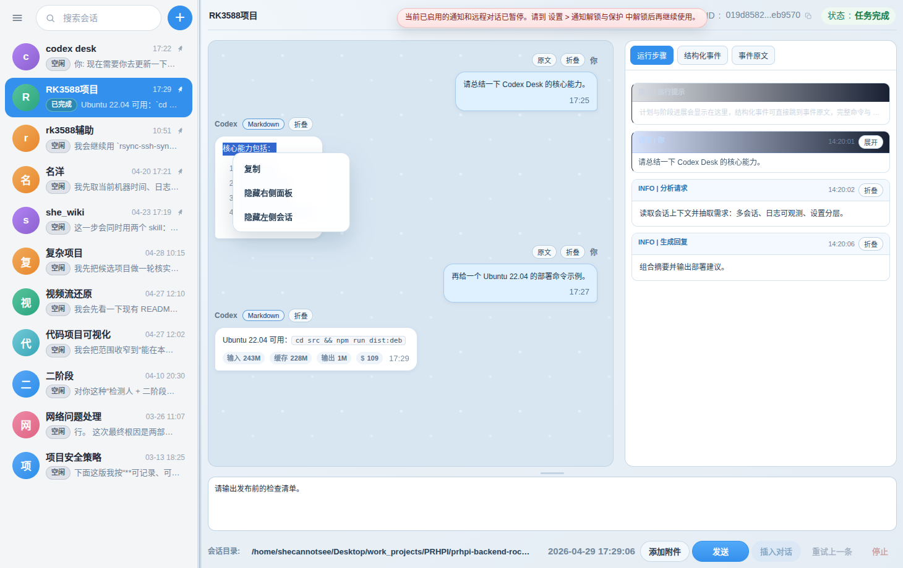

# 5 分钟上手

## 1. 前置条件

- Ubuntu 22.04（当前已验证平台）。
- Node.js 18+ 和 npm。
- 已安装并登录 Codex CLI，终端中 `codex --version` 可用。

```bash
node -v
npm -v
codex --version
```

## 2. 启动

推荐根目录脚本：

```bash
cd /home/shecannotsee/Desktop/projects/codex-desk-electron
./start.sh
```

开发方式：

```bash
cd /home/shecannotsee/Desktop/projects/codex-desk-electron/src
npm install
npm run check
npm start
```

## 3. 创建会话并发送

1. 左侧会话列表空白处右键，选择“新建对话”。
2. 选择或确认工作目录。
3. 在底部输入框输入请求。
4. 按 `Ctrl+Enter` 或点击“发送”。

预期：

- 中间聊天区显示用户消息和 assistant 回复。
- 右侧运行面板显示“运行步骤 / 结构化事件 / 事件原文”。
- 底部“会话目录”左键可打开目录，右键可复制路径。

## 4. 快速验证功能

- 运行中再次发送消息：应进入当前会话队列。
- 切到“运行步骤”：可查看步骤、排队消息和完成状态。
- 选中聊天区或运行区文本后右键：可复制。
- 点击回复里的 HTTP 链接：用系统默认浏览器打开。
- 点击回复里的本地文件路径链接：用系统方式打开文件或目录。
- 设置里切换主题、语言、缩放、侧栏和运行面板。
- 配置 Telegram 通知后，任务完成/失败可发通知。
- 开启 Telegram 远程控制后，可用 Telegram 命令查看/选择会话并发送消息。

## 5. 截图预览







## 6. 失败时优先检查

1. `codex --version` 是否可用。
2. 当前会话工作目录是否存在。
3. 右侧“结构化事件”是否有 `error` 或 `warn`。
4. 右侧“事件原文”是否有 Codex JSON 错误。
5. Telegram token 是否被主密码锁定。
