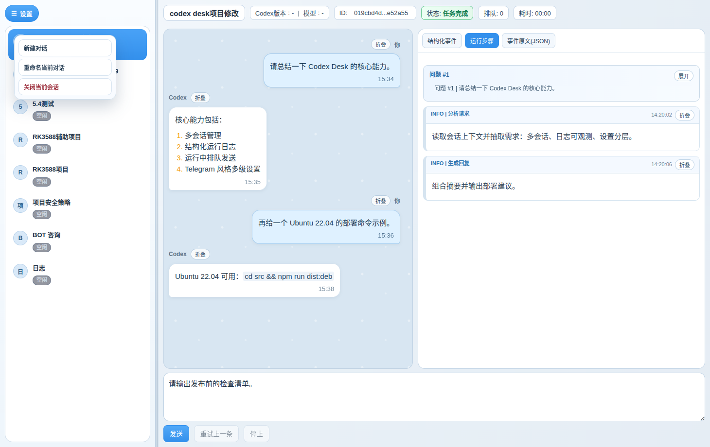
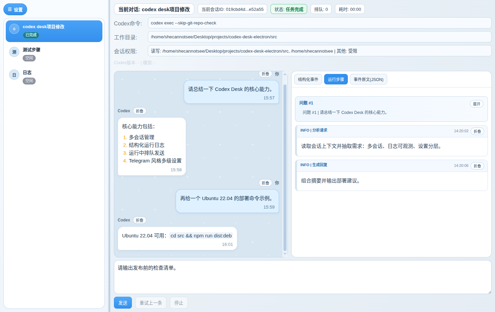
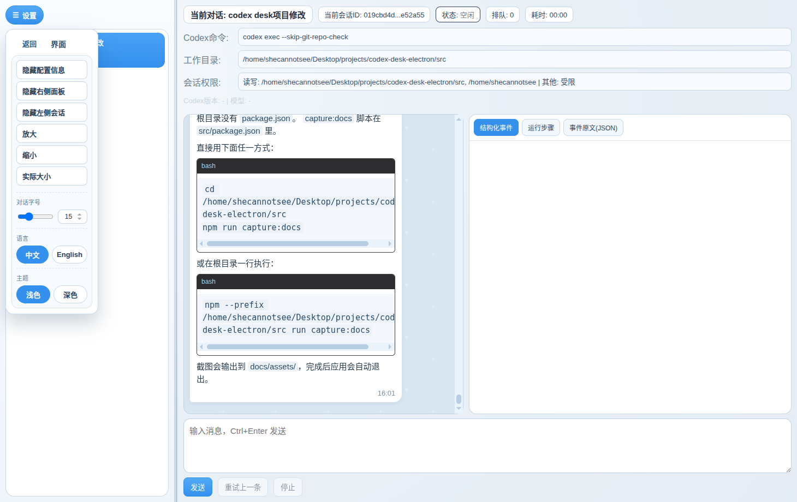

# 用户指南（按场景）

> 统一模板：功能目标 / 操作步骤 / 参数配置 / 错误边界 / CLI 关系。

## 场景 1：创建会话并发送消息

### 功能目标

快速开始一轮 Codex 对话并保留历史。

### 操作步骤

1. 左侧会话列表区域右键，点“新建对话”。
2. 在输入框输入内容。
3. 按 `Ctrl+Enter` 或点击“发送”。

### 参数/配置说明

- `Codex命令`：默认 `codex exec --skip-git-repo-check --dangerously-bypass-approvals-and-sandbox`
- `工作目录`：必须存在
- `会话权限`：根据命令参数自动推断展示

### 错误与边界情况

- 未创建会话时发送：提示先新建会话。
- 消息为空：会拦截。
- 工作目录不存在：返回明确错误。

### 与 CLI 的关系

- 基本等价：`codex exec <PROMPT>`
- GUI 自动管理会话列表与历史。

---

## 场景 2：运行中继续提问（排队）

### 功能目标

上一条未完成时继续提问，按顺序串行执行。

### 操作步骤

1. 发送一条耗时请求。
2. 运行中继续发送新消息。
3. 观察顶部“排队”数量。
4. 切到“运行步骤”标签查看“待执行排队消息”。

### 参数/配置说明

- 队列按“会话隔离”。
- 队列按发送顺序执行。

### 错误与边界情况

- 队列消息启动失败会写入结构化事件。

### 与 CLI 的关系

- CLI 原生不提供队列管理；GUI 提供增强调度。

---

## 场景 3：查看运行过程（结构化事件 / 运行步骤 / JSON）

### 功能目标

对运行过程做审计和回放，而不只看最终回复。

### 操作步骤

1. 打开右侧日志区。
2. 切换三个标签：结构化事件 / 运行步骤 / 事件原文(JSON)。
3. 在“运行步骤”里按需展开某一条步骤。

### 参数/配置说明

- 运行步骤默认折叠。
- 折叠状态按会话单独维护。

### 错误与边界情况

- 任务运行中清空日志会被保护。

### 与 CLI 的关系

- CLI 主要是原始输出；GUI 提供多视角并行。

---

## 场景 4：会话管理（右键操作）

### 功能目标

通过右键菜单低噪音管理多会话。

### 操作步骤

1. 在左侧会话列表中右键目标会话。
2. 选择“重命名当前对话”或“关闭当前会话”。
3. 右键空白处可“新建对话”。

### 参数/配置说明

- 会话项显示为“圆形头像 + 标题 + 状态标签”。

### 错误与边界情况

- 关闭最后一个正在运行会话时会阻止误操作。

### 与 CLI 的关系

- CLI 通常是单会话命令；GUI 提供会话生命周期管理。

---

## 场景 5：设置面板（Telegram 风格多级）

### 功能目标

将高频操作集中到一个分层设置入口，降低页面噪音。

### 操作步骤

1. 点击右上角“设置”。
2. 在一级分组中选择：对话 / 运行 / 界面 / 窗口 / 帮助。
3. 进入二级页执行对应动作。

### 参数/配置说明

- 语言和主题采用分段按钮。
- 语言入口仅保留在设置中，不在顶部配置行展示。

### 错误与边界情况

- 与当前会话有关的动作在无会话时会禁用。

### 与 CLI 的关系

- CLI 无同类 GUI 菜单层。

---

## 场景 6：视觉与布局控制

### 功能目标

在信息密度、可读性和可见区域之间快速平衡。

### 操作步骤

1. 调整“对话字号”（滑杆 + 数字输入）。
2. 在“设置 -> 视图”切换：
   - 隐藏/显示配置信息
   - 隐藏/显示右侧日志区
   - 隐藏/显示左侧会话
3. 拖动左侧边界调整会话区宽度。
4. 使用“放大/缩小/实际大小”控制窗口级缩放。
5. 切换“主题：浅色/深色”。

### 参数/配置说明

- 对话字号与视图缩放独立，最终效果叠加。
- 主题切换会同步影响运行步骤与滚动条配色。

### 错误与边界情况

- 无。

### 与 CLI 的关系

- CLI 无 GUI 视图层。

---

## 场景 7：运行中关闭窗口

### 功能目标

防止误关闭中断任务。

### 操作步骤

关闭窗口时若存在运行任务，会出现确认弹窗：

1. 取消
2. 停止任务并关闭
3. 直接关闭

### 参数/配置说明

- “停止任务并关闭”会先发 stop，再等待短时间。

### 错误与边界情况

- 强制关闭可能造成当轮输出不完整。

### 与 CLI 的关系

- CLI 的中断由终端/进程管理；GUI 提供关闭保护。

## 截图

- 自动截图命令：`cd src && npm run capture:docs`
- 会话右键菜单  

- 运行日志三标签  

- 设置多级菜单  

